# 이커머스 DW 데이터 카탈로그 (AI 에이전트 질의 가이드)

본 문서는 AI 에이전트 및 데이터 분석가가 데이터웨어하우스(ClickHouse)와 운영 DB(PostgreSQL)에 질의할 때 참조할 수 있도록 구성된 공식 시맨틱 명세서입니다. 15개 테이블 간의 릴레이션 관계와 조인 방법, 그리고 감성 분석 및 RFM 지표 활용법을 다룹니다.

---

## 1. 데이터 모델 관계도 (ERD)

아래 다이어그램은 이커머스 DW 핵심 테이블의 물리적/논리적 관계를 나타냅니다.

```mermaid
erDiagram
    dim_calendar ||--o{ fact_orders : "order_date (date_id)"
    dim_calendar ||--o{ fact_returns : "return_date (date_id)"
    dim_calendar ||--o{ fact_marketing_spend : "marketing_date (date_id)"
    dim_calendar ||--o{ fact_fulfillment_performance : "performance_date (date_id)"
    
    dim_location ||--o{ dim_customer : "residence"
    dim_location ||--o{ dim_delivery_person : "workplace"
    dim_location ||--o{ dim_seller : "shop_location"
    dim_location ||--o{ fact_orders : "shipping_destination"
    dim_location ||--o{ fact_returns : "return_origin"
    dim_location ||--o{ fact_fulfillment_performance : "hub_location"

    dim_customer ||--o{ fact_orders : "places"
    dim_customer ||--o{ fact_returns : "requests"
    dim_customer ||--o{ fact_customer_rfm : "has_profile"

    dim_product ||--o{ fact_orders : "contains"
    dim_product ||--o{ fact_returns : "returned_item"

    dim_seller ||--o{ fact_orders : "sells"

    dim_delivery_person ||--o{ fact_orders : "delivers"
    dim_delivery_person ||--o{ fact_fulfillment_performance : "assigned_to"

    dim_fulfillment ||--o{ fact_orders : "shipped_via"
    dim_fulfillment ||--o{ fact_returns : "returned_via"
    dim_fulfillment ||--o{ fact_fulfillment_performance : "measured_in"

    dim_payment ||--o{ fact_orders : "paid_with"
    dim_payment ||--o{ fact_returns : "refunded_to"

    dim_channel ||--o{ dim_campaign : "belongs_to"
    dim_channel ||--o{ fact_marketing_spend : "tracked_on"
    dim_campaign ||--o{ fact_orders : "referred_by"
    dim_campaign ||--o{ fact_marketing_spend : "spent_on"
```



---

## 2. 조인 매핑 가이드 (Join Reference Table)

테이블 간 조인 관계를 생성할 때 AI 에이전트는 다음 규칙과 조인 키를 활용해야 합니다.

| 소스 테이블 (팩트) | 타겟 테이블 (차원) | 조인 키 컬럼 (FK -> PK) | 관계 설명 |
| :--- | :--- | :--- | :--- |
| **fact_orders** | dim_customer | `customer_id` | 주문을 수행한 고객의 인적 사항 정보 |
| **fact_orders** | dim_product | `product_id` | 주문된 상품의 브랜드, 카테고리 정보 |
| **fact_orders** | dim_seller | `seller_id` | 해당 상품의 입점 판매자(셀러) 정보 |
| **fact_orders** | dim_location | `location_id` | 주문 배송 목적지(주, 도시, 우편번호) 정보 |
| **fact_orders** | dim_calendar | `date_id` | 주문 일자(연도, 분기, 월, 주말 여부) 정보 |
| **fact_orders** | dim_delivery_person | `delivery_person_id` | 담당 배송 기사 정보 |
| **fact_orders** | dim_payment | `payment_id` | 사용된 결제 수단 및 대행 기관 정보 |
| **fact_orders** | dim_campaign | `campaign_id` | 유입 경로가 된 마케팅 캠페인 정보 |
| **fact_orders** | dim_fulfillment | `fulfillment_id` | 배송 수단 등 물류 처리 정보 |
| **fact_returns** | fact_orders | `order_line_id` | 반품된 거래의 원주문 상세 내역 |
| **fact_customer_rfm** | dim_customer | `customer_id` | 고객별 RFM 세그먼트와 고객 마스터 프로필 |
| **fact_marketing_spend** | dim_campaign | `campaign_id` | 광고비가 집행된 캠페인 마스터 정보 |
| **fact_marketing_spend** | dim_channel | `channel_id` | 광고 유입 채널 정보 |

---

## 3. ClickHouse 쿼리 작성 시 중요 그라운드 룰 (그림자 방지)
1. **`FINAL` 키워드 사용**: ClickHouse는 ReplacingMergeTree 엔진을 기반으로 중복 데이터를 실시간/비동기적으로 제거합니다. 따라서 **조회 시점에 최신의 고유 데이터만 가져오려면 실버 레이어의 모든 테이블명 뒤에 반드시 `FINAL` 키워드를 기입해야 합니다.**
2. **일자 조인**: `date_id`는 8자리 정수형(`YYYYMMDD`)으로 통일되어 있습니다. `full_date` 대신 `date_id`를 조인 조건으로 삼아야 성능이 최적화됩니다.
3. **가명화 조인**: `customer_id`는 마스킹 처리(SHA-256)되어 저장되므로, `dim_customer`와 `fact_orders`, `fact_customer_rfm` 간의 조인은 마스킹된 `customer_id` 값을 기준으로 자연스럽게 수행됩니다.

---

## 4. AI 에이전트용 Few-Shot 예제 SQL (자연어 질의 -> SQL)

### 예제 1. "2026년 1분기 기준, 카테고리별 총 실 결제금액(net_amount)과 평균 배송지연일수를 조회해줘."
```sql
SELECT 
    p.category as product_category,
    SUM(o.net_amount) as total_net_amount,
    AVG(o.delivery_delay_days) as avg_delivery_delay_days
FROM default.fact_orders FINAL as o
INNER JOIN default.dim_product FINAL as p 
    ON o.product_id = p.product_id
INNER JOIN default.dim_calendar FINAL as cal 
    ON o.date_id = cal.date_id
WHERE cal.year = 2026 
  AND cal.quarter = 1
GROUP BY product_category
ORDER BY total_net_amount DESC;
```

### 예제 2. "최근 이탈 위험(At Risk) 고객들이 가장 많이 구매한 상품 브랜드 Top 5는 무엇인가요?"
```sql
SELECT 
    p.brand as product_brand,
    COUNT(DISTINCT o.order_id) as total_orders,
    SUM(o.quantity) as total_quantity
FROM default.fact_orders FINAL as o
INNER JOIN default.dim_product FINAL as p 
    ON o.product_id = p.product_id
INNER JOIN default.fact_customer_rfm FINAL as rfm 
    ON o.customer_id = rfm.customer_id
WHERE rfm.customer_segment = 'At Risk'
GROUP BY product_brand
ORDER BY total_orders DESC
LIMIT 5;
```

### 예제 3. "각 마케팅 채널 유형별로 집행된 광고비 대비 발생 매출 비율(ROAS)을 구해줘."
```sql
SELECT 
    chan.channel_type as channel_type,
    SUM(m.spend_amount) as total_spend,
    SUM(m.revenue_generated) as total_revenue,
    CASE 
        WHEN total_spend > 0 THEN (total_revenue / total_spend) * 100 
        ELSE 0 
    END as roas_percentage
FROM default.fact_marketing_spend FINAL as m
INNER JOIN default.dim_channel FINAL as chan 
    ON m.channel_id = chan.channel_id
GROUP BY channel_type
ORDER BY roas_percentage DESC;
```
